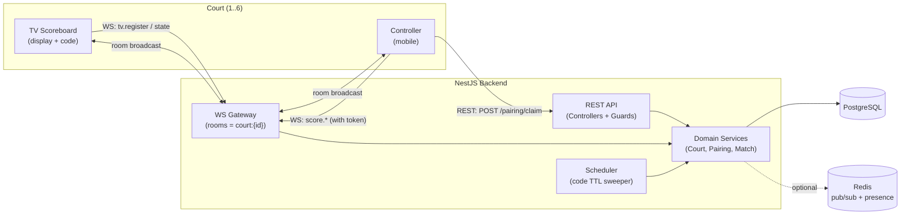
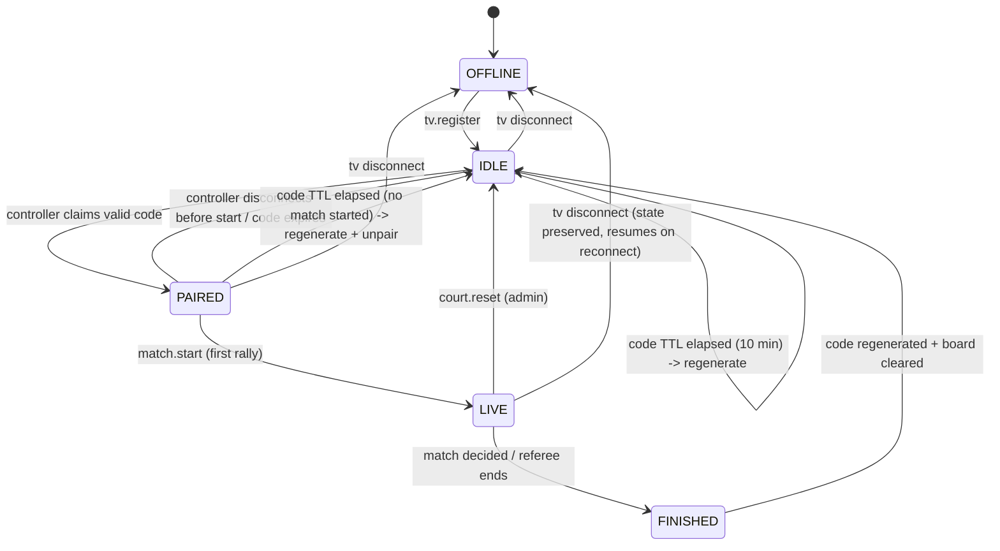

# Squash Court Management & TV Pairing — Technical Specification

**Version:** 1.0
**Status:** Implementation-ready
**Scope:** Real-time pairing and scoring platform for up to **6 squash courts**, each with a
dedicated TV scoreboard paired to mobile scoring devices.

**Target stack (per product decision):**

- **Backend:** Node.js + **NestJS** (TypeScript)
- **Database:** **PostgreSQL** (single source of truth, including pairing codes & expiry)
- **Real-time:** WebSocket via `@nestjs/websockets` + Socket.IO
- **Cache/scale-out (optional):** Redis — *not required*; called out only where it improves
  horizontal scaling. All correctness rules are satisfied by Postgres alone.
- **Frontend:** Vue 3 (existing app) — TV display + mobile controller.

---

## 1. System Overview

Each physical court has two logical clients:

1. **TV client** (the scoreboard screen mounted at the court). It registers itself, displays a
   short **pairing code**, and renders live score state. It is a *display + code presenter*.
2. **Controller client** (a referee/player phone). It enters the code shown on the TV to
   **pair** with that court, then sends scoring commands.

A court may have **one TV** and **one active controller** at a time (configurable to allow
read-only spectator controllers). The backend is the single authority for codes, sessions,
and score state; both clients are thin and reconnect-safe.

### 1.1 High-level architecture



### 1.2 Why the backend is authoritative

- **Collision-free codes:** a unique partial index guarantees no two *active* codes collide.
- **Deterministic expiry:** `expires_at` columns + a single scheduler avoid multi-tab/
  multi-instance double-generation races.
- **Security:** clients never trust each other; every mutation carries a server-issued,
  court-scoped, revocable token.

---

## 2. Domain Model & State

### 2.1 Court lifecycle (state machine)



**State definitions**

| State      | Meaning                                                        | Code regenerates? |
|------------|---------------------------------------------------------------|-------------------|
| `OFFLINE`  | No TV connected for this court.                               | No code shown |
| `IDLE`     | TV online, no controller paired, no match.                   | **Yes — every 10 min** |
| `PAIRED`   | Controller connected, match configured but not started.      | Yes (10 min) until start |
| `LIVE`     | Match in progress.                                            | **No** (frozen) |
| `FINISHED` | Match decided; transient.                                    | **Immediate regenerate** → IDLE |

### 2.2 Code regeneration rules (requirements 4 & 5)

1. **Idle regeneration:** while a court is `IDLE` or `PAIRED` (no started match), its code is
   reissued **every 10 minutes** (`expires_at = now() + interval '10 minutes'`). The previous
   code is invalidated atomically.
2. **Post-match regeneration:** when a match transitions to `FINISHED`, a new code is generated
   **immediately** (synchronously in the same transaction that closes the match), before the
   court returns to `IDLE`.
3. **Frozen during play:** while `LIVE`, the TTL sweeper **skips** the court so an in-progress
   match never loses its pairing.

### 2.3 Pairing code format

- **6-digit numeric** string, zero-padded (`"048213"`), human-enterable on a phone keypad.
- Excludes nothing structurally, but generation **re-rolls on collision** (see §6.3).
- Namespace: 10^6 = 1,000,000 combinations; at most 6 active at once → collision probability
  per generation ≈ 6×10⁻⁶. A unique index makes residual collisions impossible, not just rare.
- Codes are **single-court** and **single-active**: a court has exactly one valid code at a time.

---

## 3. Database Schema (PostgreSQL)

```sql
-- =========================================================
-- Extensions
-- =========================================================
CREATE EXTENSION IF NOT EXISTS "pgcrypto";   -- gen_random_uuid()

-- =========================================================
-- ENUM types
-- =========================================================
CREATE TYPE court_status   AS ENUM ('OFFLINE','IDLE','PAIRED','LIVE','FINISHED');
CREATE TYPE device_role    AS ENUM ('TV','CONTROLLER','SPECTATOR');
CREATE TYPE session_status AS ENUM ('ACTIVE','EXPIRED','REVOKED','DISCONNECTED');
CREATE TYPE match_status   AS ENUM ('CONFIGURED','LIVE','FINISHED','ABANDONED');

-- =========================================================
-- courts  (exactly 6 rows; enforced by CHECK + seed)
-- =========================================================
CREATE TABLE courts (
  id            SMALLINT PRIMARY KEY CHECK (id BETWEEN 1 AND 6),
  name          TEXT        NOT NULL,
  status        court_status NOT NULL DEFAULT 'OFFLINE',
  tv_socket_id  TEXT,                      -- current TV ws connection (nullable)
  current_match_id UUID,                   -- FK set when a match is configured/live
  created_at    TIMESTAMPTZ NOT NULL DEFAULT now(),
  updated_at    TIMESTAMPTZ NOT NULL DEFAULT now()
);

-- =========================================================
-- pairing_codes  (one ACTIVE per court; history retained)
-- =========================================================
CREATE TABLE pairing_codes (
  id           UUID PRIMARY KEY DEFAULT gen_random_uuid(),
  court_id     SMALLINT NOT NULL REFERENCES courts(id) ON DELETE CASCADE,
  code         CHAR(6)  NOT NULL,
  is_active    BOOLEAN  NOT NULL DEFAULT TRUE,
  created_at   TIMESTAMPTZ NOT NULL DEFAULT now(),
  expires_at   TIMESTAMPTZ NOT NULL,
  consumed_at  TIMESTAMPTZ,               -- when first successfully claimed
  reason       TEXT                       -- 'idle_ttl' | 'post_match' | 'manual' | 'startup'
);

-- Collision prevention (requirement 6): no two ACTIVE codes may share a value.
CREATE UNIQUE INDEX uniq_active_code
  ON pairing_codes (code) WHERE is_active;

-- At most one ACTIVE code per court.
CREATE UNIQUE INDEX uniq_active_code_per_court
  ON pairing_codes (court_id) WHERE is_active;

CREATE INDEX idx_codes_expiry ON pairing_codes (expires_at) WHERE is_active;

-- =========================================================
-- device_sessions  (a paired device + its bearer token)
-- =========================================================
CREATE TABLE device_sessions (
  id            UUID PRIMARY KEY DEFAULT gen_random_uuid(),
  court_id      SMALLINT NOT NULL REFERENCES courts(id) ON DELETE CASCADE,
  role          device_role NOT NULL,
  -- store only a hash of the bearer token, never the token itself
  token_hash    TEXT NOT NULL,
  pairing_code_id UUID REFERENCES pairing_codes(id),
  device_label  TEXT,                      -- 'Referee iPhone' etc.
  status        session_status NOT NULL DEFAULT 'ACTIVE',
  ip_address    INET,
  user_agent    TEXT,
  socket_id     TEXT,                      -- current ws connection
  created_at    TIMESTAMPTZ NOT NULL DEFAULT now(),
  last_seen_at  TIMESTAMPTZ NOT NULL DEFAULT now(),
  expires_at    TIMESTAMPTZ NOT NULL,      -- absolute session cap (e.g. now()+4h)
  revoked_at    TIMESTAMPTZ
);

CREATE UNIQUE INDEX uniq_token_hash ON device_sessions (token_hash);
-- One ACTIVE controller per court (drop the WHERE role filter to allow many spectators).
CREATE UNIQUE INDEX uniq_active_controller_per_court
  ON device_sessions (court_id)
  WHERE status = 'ACTIVE' AND role = 'CONTROLLER';
CREATE INDEX idx_sessions_court ON device_sessions (court_id, status);

-- =========================================================
-- matches  (per court; the scored entity)
-- =========================================================
CREATE TABLE matches (
  id            UUID PRIMARY KEY DEFAULT gen_random_uuid(),
  court_id      SMALLINT NOT NULL REFERENCES courts(id) ON DELETE CASCADE,
  status        match_status NOT NULL DEFAULT 'CONFIGURED',
  home_name     TEXT NOT NULL,
  away_name     TEXT NOT NULL,
  draw_label    TEXT,
  best_of       SMALLINT NOT NULL DEFAULT 5 CHECK (best_of IN (3,5)),
  points_to_win SMALLINT NOT NULL DEFAULT 11,
  home_games    SMALLINT NOT NULL DEFAULT 0,
  away_games    SMALLINT NOT NULL DEFAULT 0,
  home_points   SMALLINT NOT NULL DEFAULT 0,
  away_points   SMALLINT NOT NULL DEFAULT 0,
  serving       CHAR(4) NOT NULL DEFAULT 'home' CHECK (serving IN ('home','away')),
  rubber        SMALLINT NOT NULL DEFAULT 1,
  winner        CHAR(4) CHECK (winner IN ('home','away')),
  started_at    TIMESTAMPTZ,
  ended_at      TIMESTAMPTZ,
  created_at    TIMESTAMPTZ NOT NULL DEFAULT now(),
  updated_at    TIMESTAMPTZ NOT NULL DEFAULT now()
);
CREATE INDEX idx_matches_court ON matches (court_id, status);

ALTER TABLE courts
  ADD CONSTRAINT fk_current_match
  FOREIGN KEY (current_match_id) REFERENCES matches(id) ON DELETE SET NULL;

-- =========================================================
-- score_events  (append-only audit / event-sourcing log)
-- =========================================================
CREATE TABLE score_events (
  id          BIGSERIAL PRIMARY KEY,
  match_id    UUID NOT NULL REFERENCES matches(id) ON DELETE CASCADE,
  session_id  UUID REFERENCES device_sessions(id),
  seq         INTEGER NOT NULL,            -- per-match monotonic, for idempotency
  type        TEXT NOT NULL,              -- 'POINT'|'UNDO'|'FOUL'|'SERVE'|'NEXT_GAME'|'RESET'
  payload     JSONB NOT NULL DEFAULT '{}',
  created_at  TIMESTAMPTZ NOT NULL DEFAULT now()
);
CREATE UNIQUE INDEX uniq_event_seq ON score_events (match_id, seq);

-- =========================================================
-- audit_log  (security-relevant actions)
-- =========================================================
CREATE TABLE audit_log (
  id          BIGSERIAL PRIMARY KEY,
  court_id    SMALLINT,
  session_id  UUID,
  action      TEXT NOT NULL,              -- 'PAIR_OK'|'PAIR_FAIL'|'REVOKE'|'CODE_ROTATE'...
  detail      JSONB NOT NULL DEFAULT '{}',
  ip_address  INET,
  created_at  TIMESTAMPTZ NOT NULL DEFAULT now()
);

-- Seed exactly 6 courts.
INSERT INTO courts (id, name) VALUES
  (1,'Court 1'),(2,'Court 2'),(3,'Court 3'),
  (4,'Court 4'),(5,'Court 5'),(6,'Court 6')
ON CONFLICT (id) DO NOTHING;
```

### 3.1 Schema notes

- **Requirement 1 (max 6 courts):** `CHECK (id BETWEEN 1 AND 6)` plus a fixed seed; the
  service layer refuses to create a 7th court.
- **Requirement 6 (no collisions):** `uniq_active_code` partial unique index. Generation runs
  inside a transaction; a duplicate raises `23505` and the service re-rolls.
- **Tokens at rest:** only `token_hash` (SHA-256 of the bearer token) is stored. A leaked DB
  cannot be used to impersonate a device.

---

## 4. REST API

Base path `/api/v1`. All responses JSON. Auth: TV endpoints use a **provisioning key**;
controller endpoints use the **bearer token** issued at pairing (header
`Authorization: Bearer <token>`), except `claim` which is the unauthenticated entry point.

### 4.1 TV / display

| Method | Path | Auth | Purpose |
|--------|------|------|---------|
| `POST` | `/courts/:id/tv/register` | provisioning key | TV announces itself; returns current code + state. |
| `POST` | `/courts/:id/tv/heartbeat` | provisioning key | Keep TV presence alive. |
| `GET`  | `/courts/:id/state` | provisioning key / token | Snapshot of court + match + active code. |

`POST /courts/3/tv/register` → `201`
```json
{
  "court": { "id": 3, "name": "Court 3", "status": "IDLE" },
  "pairing": { "code": "048213", "expiresAt": "2026-06-22T10:40:00Z" },
  "match": null
}
```

### 4.2 Pairing (controller entry point)

| Method | Path | Auth | Purpose |
|--------|------|------|---------|
| `POST` | `/pairing/claim` | none + rate-limited | Submit a code, receive a court-scoped token. |
| `POST` | `/pairing/refresh` | bearer | Rotate token before absolute expiry. |
| `DELETE` | `/pairing/session` | bearer | Controller voluntarily disconnects (unpair). |

`POST /pairing/claim`
```json
// request
{ "code": "048213", "deviceLabel": "Referee iPhone" }
// 200 OK
{
  "token": "eyJ...opaque...",        // store in memory / secure storage
  "courtId": 3,
  "role": "CONTROLLER",
  "expiresAt": "2026-06-22T14:40:00Z"
}
```

**Claim error contract**

| HTTP | `code` | When |
|------|--------|------|
| `404` | `CODE_NOT_FOUND` | No active code equals the input. |
| `410` | `CODE_EXPIRED` | Code matched a row but `expires_at < now()`. |
| `409` | `COURT_BUSY` | Court already has an active controller. |
| `423` | `COURT_LIVE_LOCKED` | Court mid-match and locked to its controller. |
| `429` | `TOO_MANY_ATTEMPTS` | Rate limit / brute-force guard tripped. |

### 4.3 Match & scoring (controller)

> Scoring is normally done over WebSocket for latency; REST equivalents exist for
> resilience and server-to-server use. All are **idempotent** via `seq`.

| Method | Path | Purpose |
|--------|------|---------|
| `POST` | `/courts/:id/match` | Configure a match (home/away/draw/bestOf). |
| `POST` | `/courts/:id/match/start` | IDLE/PAIRED → LIVE. |
| `POST` | `/courts/:id/match/end` | LIVE → FINISHED (+ immediate code regen). |
| `POST` | `/courts/:id/score` | Apply a scoring command (`{seq,type,side}`). |
| `POST` | `/courts/:id/reset` | Admin reset → clears board, regenerates code. |

### 4.4 Admin

| Method | Path | Purpose |
|--------|------|---------|
| `GET` | `/admin/courts` | All 6 courts with status/sessions/codes. |
| `POST` | `/admin/courts/:id/rotate-code` | Force code rotation. |
| `POST` | `/admin/sessions/:id/revoke` | Kill a device session. |

---

## 5. WebSocket Protocol

Namespace `/rt`. Transport Socket.IO. **Rooms:** every court is a room `court:{id}`. The TV
joins read-only; the controller joins read-write after the gateway validates its token in the
handshake (`auth: { token }`).

### 5.1 Client → Server events

| Event | Sender | Payload | Notes |
|-------|--------|---------|-------|
| `tv:join` | TV | `{ courtId, provisioningKey }` | Joins room read-only. |
| `ctrl:join` | Controller | `{ token }` | Token validated; joins room read-write. |
| `score:cmd` | Controller | `{ seq, type, side? }` | `type ∈ POINT,UNDO,FOUL,SERVE,NEXT_GAME`. |
| `match:start` | Controller | `{}` | → LIVE. |
| `match:end` | Controller | `{}` | → FINISHED, triggers regen. |
| `heartbeat` | both | `{}` | Presence; updates `last_seen_at`. |

### 5.2 Server → Client events

| Event | Target room | Payload | Purpose |
|-------|-------------|---------|---------|
| `court:state` | `court:{id}` | full court+match snapshot | Sent on join and after every mutation. |
| `pairing:code` | `court:{id}` | `{ code, expiresAt }` | New code issued (TV updates display). |
| `score:applied` | `court:{id}` | `{ seq, board }` | Authoritative board after a command. |
| `session:revoked` | one socket | `{ reason }` | Controller forced off (expiry/admin/court reset). |
| `court:reset` | `court:{id}` | `{}` | Board cleared. |
| `error` | one socket | `{ code, message }` | Rejected command. |

### 5.3 Pairing sequence (happy path)

```mermaid
sequenceDiagram
  participant TV
  participant API as REST API
  participant GW as WS Gateway
  participant DB as Postgres
  participant PH as Phone

  TV->>API: POST /courts/3/tv/register
  API->>DB: ensure active code (generate if none)
  API-->>TV: { code:048213, expiresAt }
  TV->>GW: tv:join {courtId:3}
  GW-->>TV: court:state (IDLE)

  Note over PH: User reads 048213 from the TV
  PH->>API: POST /pairing/claim { code:048213 }
  API->>DB: SELECT active code FOR UPDATE
  DB-->>API: row (valid, not expired)
  API->>DB: create session + token_hash; court -> PAIRED
  API-->>PH: { token, courtId:3 }
  PH->>GW: ctrl:join { token }
  GW->>DB: validate token_hash, status=ACTIVE
  GW-->>PH: court:state (PAIRED)
  GW-->>TV: court:state (PAIRED)

  PH->>GW: match:start
  GW-->>TV: court:state (LIVE)
  PH->>GW: score:cmd {seq:1,type:POINT,side:home}
  GW->>DB: append score_event(seq=1), update board
  GW-->>TV: score:applied {board}
  GW-->>PH: score:applied {board}

  PH->>GW: match:end
  GW->>DB: match FINISHED; rotate code (immediate)
  GW-->>TV: pairing:code { new code }
  GW-->>TV: court:state (IDLE)
  GW-->>PH: session:revoked { reason: match_ended }
```

---

## 6. Connection Lifecycle & Core Algorithms

### 6.1 Token issuance & validation

- On `claim`, generate a 256-bit random token: `token = base64url(randomBytes(32))`.
- Persist `token_hash = sha256(token)`; return the raw token **once**.
- Every WS/REST mutation looks up `sha256(presentedToken)` and requires
  `status='ACTIVE' AND court_id = pathCourtId AND expires_at > now()`.
- Tokens are **court-scoped**: a token for court 3 cannot mutate court 4 (defense in depth).

### 6.2 Idle TTL sweeper (single authority)

A NestJS `@Cron('*/30 * * * * *')` job (every 30 s) runs one UPDATE:

```sql
WITH expired AS (
  SELECT pc.id, pc.court_id
  FROM pairing_codes pc
  JOIN courts c ON c.id = pc.court_id
  WHERE pc.is_active
    AND pc.expires_at <= now()
    AND c.status IN ('IDLE','PAIRED')          -- never rotate a LIVE court
)
UPDATE pairing_codes SET is_active = FALSE
WHERE id IN (SELECT id FROM expired)
RETURNING court_id;
-- For each returned court_id: generate a fresh code (see 6.3) and, if PAIRED with no
-- started match, revoke its controller session and set court -> IDLE; emit pairing:code.
```

Running the sweeper as a **single scheduled job** (leader-elected in multi-instance via a
Postgres advisory lock `pg_try_advisory_lock`) prevents double regeneration.

### 6.3 Collision-free code generation

```ts
async function generateCode(courtId: number, reason: string): Promise<string> {
  for (let attempt = 0; attempt < 5; attempt++) {
    const code = String(crypto.randomInt(0, 1_000_000)).padStart(6, '0');
    try {
      await tx.query(
        `UPDATE pairing_codes SET is_active=false
         WHERE court_id=$1 AND is_active`, [courtId]);          // retire old
      await tx.query(
        `INSERT INTO pairing_codes (court_id, code, expires_at, reason)
         VALUES ($1,$2, now() + interval '10 minutes', $3)`,
        [courtId, code, reason]);                               // unique index guards
      return code;
    } catch (e) {
      if (e.code === '23505') continue;   // collision on uniq_active_code -> re-roll
      throw e;
    }
  }
  throw new ServiceUnavailable('CODE_NAMESPACE_EXHAUSTED');
}
```

The `uniq_active_code` partial index makes step "guarantee uniqueness across all courts"
atomic and race-proof even under concurrent generation.

### 6.4 Idempotent scoring

Each command carries a client `seq` (monotonic per match). The server inserts into
`score_events (match_id, seq)` with a unique constraint; a duplicate `seq` (retried after a
flaky network) is a no-op that returns the current board. This makes scoring **at-least-once
safe** over lossy mobile connections.

---

## 7. Edge Cases (requirement 9)

| # | Scenario | Handling |
|---|----------|----------|
| 1 | **Expired code claimed** | `claim` returns `410 CODE_EXPIRED`; client shows "Code expired, read the new code on the TV". TV already shows the rotated code. |
| 2 | **Two phones submit the same code simultaneously** | `SELECT ... FOR UPDATE` on the code row + `uniq_active_controller_per_court` → first wins (`200`), second gets `409 COURT_BUSY`. |
| 3 | **Code rotates between read and submit** | Old code already `is_active=false` → `404 CODE_NOT_FOUND`; prompt to re-read. |
| 4 | **Controller disconnects mid-match** | Session stays `ACTIVE` for a grace window (e.g. 90 s). TV shows "Controller reconnecting…". Same token re-`ctrl:join` resumes. After grace, session → `DISCONNECTED`, court stays `LIVE` (score preserved) and a fresh controller may claim only after admin/`reset` or grace lapse policy. |
| 5 | **TV disconnects mid-match** | Court → `OFFLINE` but match row + board persist. On `tv:register`, TV rehydrates from `GET /courts/:id/state`; no code change while `LIVE`. |
| 6 | **Match ends** | Single transaction: match `FINISHED`, code regenerated immediately, controller session revoked, court → `IDLE`. TV displays winner then the new code. |
| 7 | **Court reset by admin** | `reset` clears board, abandons match (`ABANDONED`), revokes sessions, rotates code, court → `IDLE`, broadcasts `court:reset`. |
| 8 | **Duplicate / replayed score command** | Idempotent via `score_events.seq` unique index (§6.4). |
| 9 | **Brute-force code guessing** | Per-IP + per-device rate limit (e.g. 5 attempts / 30 s, then exponential backoff); `429`; audit `PAIR_FAIL`; optional global lock after threshold. 6-digit space + short TTL + rate limit keeps guess success negligible. |
| 10 | **7th court requested** | Service rejects (`courts.id` CHECK + guard) — hard cap of 6. |
| 11 | **Clock skew on client** | Expiry is evaluated **server-side** only; clients treat `expiresAt` as advisory for countdown UI. |
| 12 | **Stale token after server restart** | `token_hash` is durable in Postgres, so sessions survive restarts; WS clients auto-reconnect and re-`ctrl:join`. |

---

## 8. Security Recommendations (requirement 7 & 10)

1. **Transport:** TLS everywhere (`wss://`, `https://`). HSTS on the API.
2. **Token model:** 256-bit opaque random tokens, stored hashed (SHA-256), court-scoped,
   absolute expiry (≤ 4 h) + idle expiry, revocable, rotated on `refresh`.
3. **Pairing entry hardening:** rate-limit `/pairing/claim` per IP and per device fingerprint;
   exponential backoff; CAPTCHA escalation after N failures; full `audit_log` of attempts.
4. **Short-lived codes:** 10-minute TTL caps the window for shoulder-surfing/replay; immediate
   rotation after a match removes reuse.
5. **Least privilege:** TVs use a provisioning key that can *only* register/heartbeat/read —
   never score. Controllers can score only their own court.
6. **Single-writer invariant:** `uniq_active_controller_per_court` prevents two writers from
   racing the same board; spectators (if enabled) are strictly read-only.
7. **Input validation:** strict DTO validation (`class-validator`), reject non-6-digit codes
   before any DB hit; clamp score payloads to legal transitions server-side (never trust the
   client's board).
8. **WS authz:** validate the token in the Socket.IO handshake middleware; reject join if the
   token's `court_id` ≠ requested room; disconnect on `session:revoked`.
9. **DB hygiene:** parameterized queries only; `pgcrypto` for randomness; row-level audit;
   principle-of-least-privilege DB roles (the app role cannot DROP).
10. **Abuse / DoS:** connection caps per court (1 TV + 1 controller + bounded spectators);
    global WS connection limits; structured logging + alerting on `PAIR_FAIL` spikes.
11. **Privacy:** store minimal device metadata; purge `device_sessions`/`audit_log` on a
    retention schedule.

---

## 9. NestJS Module Layout (implementation guide)

```
src/
├── app.module.ts
├── courts/
│   ├── courts.module.ts
│   ├── courts.controller.ts        # REST §4.1
│   ├── courts.service.ts           # state machine §2.1
│   └── entities/court.entity.ts
├── pairing/
│   ├── pairing.module.ts
│   ├── pairing.controller.ts       # §4.2 claim/refresh/disconnect
│   ├── pairing.service.ts          # generateCode §6.3, claim §6.1
│   ├── code-sweeper.service.ts     # @Cron TTL sweeper §6.2 (advisory lock)
│   └── guards/bearer.guard.ts
├── matches/
│   ├── matches.module.ts
│   ├── matches.service.ts          # scoring §6.4, end -> regen
│   └── entities/match.entity.ts
├── realtime/
│   ├── realtime.gateway.ts         # WS §5, rooms court:{id}
│   └── ws-auth.middleware.ts
├── security/
│   ├── rate-limit.guard.ts
│   └── audit.service.ts
└── common/ (dtos, filters, interceptors)
```

**Key transactions to implement atomically**

- `claim(code)` → validate + create session + court→PAIRED (one tx, `FOR UPDATE`).
- `endMatch()` → match FINISHED + `generateCode('post_match')` + revoke controller + court→IDLE.
- `reset()` → abandon match + revoke sessions + rotate code + court→IDLE.

---

## 10. Frontend Integration (this repo)

The existing Vue app ships a **client-side simulation** of this backend so the flow is fully
demonstrable without a server. It mirrors the contracts above:

- `src/pairing/courtHub.ts` — authoritative in-browser store for all 6 courts: code generation
  (collision-free), 10-minute idle regeneration, immediate post-match regeneration, frozen
  codes while LIVE, session tokens, expiry, and per-court score state. Cross-tab/device sync
  uses `BroadcastChannel` + `localStorage` (the analogue of the WS room broadcast).
- `src/pairing/useCourtHub.ts` — reactive composable (the analogue of the REST+WS client).
- **TV view** `/tv/:courtId` — displays the court's pairing code (when not LIVE) and the live
  board; regenerates per the rules above.
- **Controller** `/controller` — enter the 6-digit code → token-scoped control of that court,
  with `CODE_NOT_FOUND` / `CODE_EXPIRED` / `COURT_BUSY` handling.
- **Courts** `/courts` — operator overview of all 6 courts and their live status/codes.

To swap the simulation for the real backend, replace `courtHub.ts` internals with REST calls
(§4) + a Socket.IO client (§5); the composable surface and the Vue components stay unchanged.

---

## 11. Requirement Traceability

| Req | Where satisfied |
|-----|-----------------|
| 1 — max 6 courts | `courts.id CHECK 1..6` (§3), seed, service guard, edge case #10 |
| 2 — unique code per TV | `pairing_codes` + TV register (§3, §4.1); frontend TV view (§10) |
| 3 — enter code to connect | `POST /pairing/claim` (§4.2); controller view (§10) |
| 4 — 10-min idle regen | TTL sweeper §6.2; `expires_at` |
| 5 — regen after match end | `endMatch` transaction §6, §9; edge case #6 |
| 6 — no collisions | `uniq_active_code` index §3; generator §6.3 |
| 7 — secure pairing | §8 (tokens, rate limits, scoping, TLS) |
| 8 — schemas/API/WS/lifecycle/state | §3, §4, §5, §6, §2 |
| 9 — edge cases | §7 |
| 10 — diagrams/tables/transitions/security | §1.1, §2.1, §3, §5.3, §8 |
