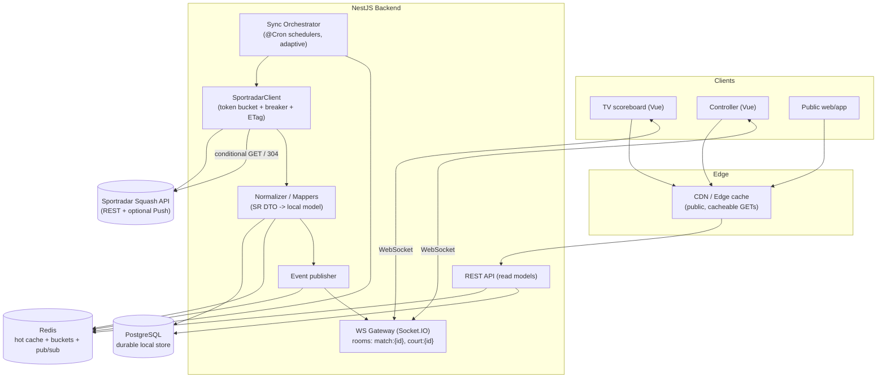
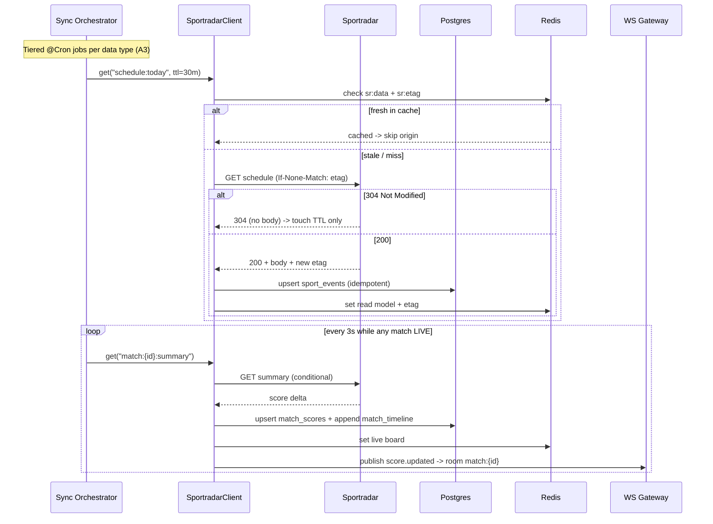
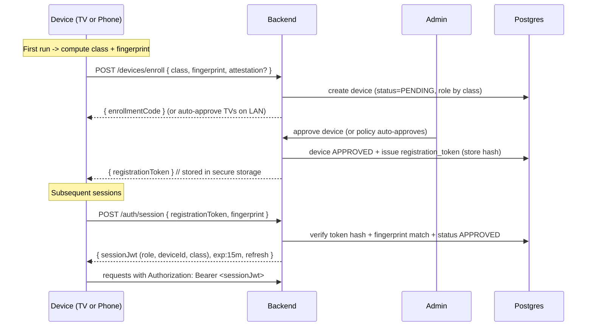

# Sportradar Integration & Device-Based Access Control — Technical Specification

**Version:** 1.0 · **Status:** Implementation-ready
**Companion to:** `COURT_PAIRING_SPEC.md` (court pairing & scoring).
**Stack:** Node.js + **NestJS** · **PostgreSQL** (durable local store) · **Redis** (hot cache +
rate-limit buckets + pub/sub) · Socket.IO (real-time) · Vue 3 frontend (TV + mobile).

This document covers two concerns:

- **Part A — Sportradar data platform:** cost-optimised ingestion, caching, synchronisation,
  local database, and real-time distribution of squash data.
- **Part B — Device-based access control:** ensuring `/controller` is reachable only from
  verified phones and the scoreboard only from verified TVs, with multi-layer validation,
  RBAC, middleware/guards, and bypass mitigations.

---

# PART A — SPORTRADAR INTEGRATION

## A1. System Architecture



**Principle: the clients never call Sportradar.** All reads hit our **read models** (Redis →
Postgres). A single backend owns Sportradar credentials and the request budget. Clients get
live updates over WebSocket; everything else is a cached REST read.

### A1.1 Caching layers (origin is Sportradar)

| Layer | Tech | Holds | Typical TTL |
|-------|------|-------|-------------|
| L0 CDN/edge | CDN | Public, non-personalised GETs (rankings, tournament info) | seconds–minutes (`Cache-Control`) |
| L1 Hot cache | Redis | Latest read models, live boards, ETag map | seconds–hours |
| L2 Durable store | PostgreSQL | Normalised entities + history | persistent |
| L3 Origin | Sportradar | Source of truth | — fetched only on miss/expiry |

Pattern: **cache-aside + stale-while-revalidate**. On read, serve L1; on miss, read L2; on L2
miss/stale, the **sync layer** (never the request path) refreshes from origin.

## A2. Sportradar Client — cost & resilience

A single `SportradarClient` wraps every outbound call and enforces:

1. **Token-bucket rate limiting** sized to the plan's QPS (e.g. 1 req/s, burst 5), backed by a
   Redis token bucket so the limit holds across instances.
2. **Conditional requests** — store `ETag`/`Last-Modified` per endpoint; send
   `If-None-Match`/`If-Modified-Since`. A `304 Not Modified` is cheap, returns no body, and
   means "skip the write" — the core of cost reduction (requirement 6).
3. **Single-flight / request coalescing** — concurrent callers for the same key await one
   in-flight promise (Redis lock `sr:lock:{key}`), preventing stampedes.
4. **Retry with exponential backoff + jitter** on `429`/`5xx`/network (e.g. 250 ms → 2 s, max
   4 tries); honour `Retry-After`.
5. **Circuit breaker** — after N consecutive failures, open for a cooldown and serve last-good
   cached data (graceful degradation); half-open probes restore service.
6. **Quota accounting** — increment a Redis counter per day/month; alert at 80 %; hard-stop
   non-essential syncs near the cap (live scores remain prioritised).

```ts
// sportradar.client.ts (essentials)
@Injectable()
export class SportradarClient {
  constructor(
    private http: HttpService,
    private redis: RedisService,
    private breaker: CircuitBreaker,
  ) {}

  async get<T>(key: string, path: string, opts: { ttl: number }): Promise<CacheResult<T>> {
    // 1) hot cache
    const hot = await this.redis.getJSON<T>(`sr:data:${key}`);
    if (hot && !hot.stale) return { data: hot.value, source: 'redis' };

    // 2) coalesce + rate-limit + conditional fetch
    return this.redis.singleFlight(`sr:lock:${key}`, async () => {
      await this.bucket.take('sportradar');                 // token bucket (429 guard)
      const etag = await this.redis.get(`sr:etag:${key}`);
      const res = await this.breaker.exec(() =>
        firstValueFrom(this.http.get(path, {
          headers: etag ? { 'If-None-Match': etag } : {},
          params: { api_key: env.SR_KEY },
        })),
      );

      if (res.status === 304) {                              // unchanged -> refresh TTL only
        await this.redis.touch(`sr:data:${key}`, opts.ttl);
        return { data: hot?.value as T, source: '304' };
      }
      await this.redis.set(`sr:etag:${key}`, res.headers.etag);
      await this.redis.setJSON(`sr:data:${key}`, res.data, opts.ttl);
      return { data: res.data as T, source: 'origin' };
    });
  }
}
```

## A3. Data classification & refresh policy (requirements 2, 3, 4, 8)

| Data type | Volatility | Mechanism | Cache TTL (Redis) | Sync interval | Real-time? |
|-----------|-----------|-----------|-------------------|---------------|-----------|
| **Live match score / timeline** | Very high (in-play) | Adaptive poll **2–6 s** while `LIVE`, or **Push feed** if available | 3 s | event-driven (only live matches) | **Yes — WebSocket** |
| Live match list ("matches today") | High | Poll | 30 s | 30–60 s | Yes (list deltas) |
| Tournament / event schedule | Medium | Periodic | 30 min | **6 h** (+ 1 h on match days) | No |
| Competitions / seasons / draws | Low–medium | Periodic | 6 h | **24 h** | No |
| Player profiles | Low | Long cache | 7 days | **7–30 days** / on-demand | No |
| Rankings | Low (weekly publish) | Long cache | 24 h | **24 h** (or webhook on publish) | No |
| Head-to-head / statistics | Low | On-demand | 12 h | on access (lazy) | No |
| **Historical results** | Immutable | Store locally, never auto-refresh | ∞ (DB) | **on demand only** | No |

**Adaptive live polling:** only matches whose status is `live` (or `starting within 15 min`)
are polled fast. A finished match is polled once more (to capture the final), then frozen and
written to history — **no further requests**. This satisfies "avoid requests when data is
unlikely to change" (requirement 6).

**Push vs poll:** if the Sportradar plan includes a push/stream feed for squash, the
`SportradarClient` subscribes and the poller becomes a fallback reconciler (every 60 s) to
heal missed messages. Otherwise adaptive polling is primary.

## A4. Synchronisation Workflow



**Sync state tracking** (one row per syncable resource) lets the orchestrator decide *whether*
to call origin at all:

- `next_sync_at` — earliest time a refresh is allowed (enforces intervals).
- `etag` / `last_modified` — for conditional requests.
- `content_hash` — if a 200 body hashes equal to the stored hash, suppress writes & events.
- `failure_count` / `circuit_state` — backoff & breaker.

## A5. Local Database Schema (PostgreSQL) — Sportradar mirror

```sql
-- Reference entities ------------------------------------------------------
CREATE TABLE competitions (
  id            TEXT PRIMARY KEY,           -- Sportradar URN, e.g. 'sr:competition:...'
  name          TEXT NOT NULL,
  gender        TEXT,                       -- 'men'|'women'|'mixed'
  category      TEXT,
  payload       JSONB NOT NULL,
  synced_at     TIMESTAMPTZ NOT NULL DEFAULT now()
);

CREATE TABLE seasons (
  id             TEXT PRIMARY KEY,
  competition_id TEXT REFERENCES competitions(id),
  year           TEXT,
  start_date     DATE,
  end_date       DATE,
  payload        JSONB NOT NULL,
  synced_at      TIMESTAMPTZ NOT NULL DEFAULT now()
);

CREATE TABLE tournaments (
  id            TEXT PRIMARY KEY,
  season_id     TEXT REFERENCES seasons(id),
  name          TEXT NOT NULL,
  venue         TEXT,
  start_date    DATE,
  end_date      DATE,
  status        TEXT,                       -- 'scheduled'|'live'|'closed'
  payload       JSONB NOT NULL,
  synced_at     TIMESTAMPTZ NOT NULL DEFAULT now()
);

CREATE TABLE players (
  id            TEXT PRIMARY KEY,           -- 'sr:competitor:...'
  name          TEXT NOT NULL,
  country       TEXT,
  country_code  CHAR(3),
  handedness    TEXT,
  payload       JSONB NOT NULL,
  synced_at     TIMESTAMPTZ NOT NULL DEFAULT now(),
  -- profiles are long-cached; refresh only when older than the policy window
  stale_after   TIMESTAMPTZ
);

CREATE TABLE rankings (
  id            BIGSERIAL PRIMARY KEY,
  ranking_type  TEXT NOT NULL,              -- 'men'|'women'
  week          DATE NOT NULL,
  player_id     TEXT REFERENCES players(id),
  rank          INTEGER NOT NULL,
  points        INTEGER,
  movement      INTEGER,
  synced_at     TIMESTAMPTZ NOT NULL DEFAULT now(),
  UNIQUE (ranking_type, week, player_id)
);

-- Match (sport_event) -----------------------------------------------------
CREATE TABLE sport_events (
  id            TEXT PRIMARY KEY,           -- 'sr:sport_event:...'
  tournament_id TEXT REFERENCES tournaments(id),
  round         TEXT,
  scheduled     TIMESTAMPTZ,
  status        TEXT NOT NULL,              -- 'not_started'|'live'|'closed'|'cancelled'
  home_id       TEXT REFERENCES players(id),
  away_id       TEXT REFERENCES players(id),
  court_label   TEXT,
  is_historical BOOLEAN NOT NULL DEFAULT FALSE,
  payload       JSONB NOT NULL,
  synced_at     TIMESTAMPTZ NOT NULL DEFAULT now()
);
CREATE INDEX idx_events_status ON sport_events (status, scheduled);
CREATE INDEX idx_events_tournament ON sport_events (tournament_id);

CREATE TABLE match_scores (
  sport_event_id TEXT PRIMARY KEY REFERENCES sport_events(id) ON DELETE CASCADE,
  home_games     SMALLINT NOT NULL DEFAULT 0,
  away_games     SMALLINT NOT NULL DEFAULT 0,
  game_scores    JSONB NOT NULL DEFAULT '[]',  -- [{game:1,home:11,away:7}, ...]
  server_side    TEXT,
  winner_id      TEXT,
  updated_at     TIMESTAMPTZ NOT NULL DEFAULT now()
);

-- Append-only point/event log for live timeline + reconciliation
CREATE TABLE match_timeline (
  id             BIGSERIAL PRIMARY KEY,
  sport_event_id TEXT NOT NULL REFERENCES sport_events(id) ON DELETE CASCADE,
  seq            INTEGER NOT NULL,
  type           TEXT NOT NULL,              -- 'point'|'game_won'|'period_start'...
  payload        JSONB NOT NULL,
  occurred_at    TIMESTAMPTZ NOT NULL,
  UNIQUE (sport_event_id, seq)
);

-- Sync bookkeeping (requirement 6 & 7) ------------------------------------
CREATE TABLE sync_state (
  resource_key  TEXT PRIMARY KEY,           -- e.g. 'schedule:2026-06-22'
  etag          TEXT,
  last_modified TEXT,
  content_hash  TEXT,
  last_synced_at TIMESTAMPTZ,
  next_sync_at   TIMESTAMPTZ,               -- gate: do not call origin before this
  failure_count INTEGER NOT NULL DEFAULT 0,
  circuit_state TEXT NOT NULL DEFAULT 'closed'
);

-- Optional raw response cache for audit/replay
CREATE TABLE api_cache (
  resource_key  TEXT PRIMARY KEY,
  status_code   SMALLINT,
  body          JSONB,
  etag          TEXT,
  fetched_at    TIMESTAMPTZ NOT NULL DEFAULT now(),
  expires_at    TIMESTAMPTZ
);
```

This local store means typical user traffic costs **zero** Sportradar calls — reads are served
from Redis/Postgres; origin is touched only by the gated sync layer.

## A6. WebSocket Event Structure (data feed)

Namespace `/feed`. Rooms: `match:{sportEventId}`, `tournament:{id}`, `rankings:{type}`.

| Event | Dir | Payload | Notes |
|-------|-----|---------|-------|
| `subscribe` | C→S | `{ channel: 'match:sr:sport_event:123' }` | Server validates & joins room. |
| `score.updated` | S→C | `{ eventId, home, away, games, lastPoint }` | Emitted only on real change (content_hash differs). |
| `match.status` | S→C | `{ eventId, status }` | `live`/`closed` transitions. |
| `schedule.changed` | S→C | `{ tournamentId, events:[…] }` | Throttled to ≤ 1/30 s. |
| `rankings.published` | S→C | `{ type, week }` | On weekly publish. |
| `feed.degraded` | S→C | `{ reason }` | Breaker open → showing last-good cache. |

Emission is **change-driven**: the publisher compares `content_hash`; identical payloads emit
nothing, so idle matches generate no socket traffic and no client churn.

---

# PART B — DEVICE-BASED ACCESS CONTROL

## B1. Goals & threat model

- **Req 10/13:** `/controller` reachable **only** from verified phones; blocked on tablets,
  desktops, and TVs.
- **Req 11/14:** scoreboard reachable **only** from verified TVs; blocked on phones/desktops.
- **Reality:** any purely client-side signal (User-Agent, screen size) is **spoofable**.
  Therefore device class is a **UX gate** on the frontend and a **hard, cryptographic gate**
  on the backend. **Authorisation is enforced server-side**; the frontend guard only improves
  UX and avoids accidental misuse.

## B2. Multi-layer device validation (requirement 12)

Validation is scored across layers; the **registration token + session** is authoritative,
the heuristics are corroborating signals and first-run classification.

| Layer | Signal | Strength | Use |
|-------|--------|----------|-----|
| 1. User-Agent | UA string parsed (Android TV, Tizen, webOS, mobile tokens) | Weak (spoofable) | First-run class hint; logging |
| 2. Device-type | Client hints (`Sec-CH-UA-*`, `navigator.userAgentData`), touch/pointer, `matchMedia` | Weak–medium | Class hint |
| 3. Screen/resolution | `screen.{width,height}`, DPR, viewport, TV ≥ ~1280×720 landscape & coarse/no pointer | Weak–medium | Class hint |
| 4. **Registration token** | Per-device secret issued at enrolment, stored hashed server-side | **Strong** | Authoritative identity |
| 5. **Session auth** | Short-lived JWT/opaque session bound to device + role | **Strong** | Per-request authorisation |
| 6. Fingerprint | Stable hash of UA+platform+screen+canvas/webgl (where allowed) | Medium | Anomaly/anti-clone detection |

**Device class derivation (heuristic, first run):**

```
isTV       = UA matches /(SMART-TV|SmartTV|Tizen|Web0S|webOS|AppleTV|GoogleTV|Android TV|
                          BRAVIA|AFT[a-z]*|HbbTV|NetCast|DTV)/i
             OR (large landscape screen ≥ 1280×720 AND pointer:none/coarse AND no touch-drag)
isMobile   = UA matches /(iPhone|Android(?!.*Tablet)|Mobile|iPod)/i
             AND maxTouchPoints > 0 AND screen min-dimension < 820px (portrait-capable)
isTablet   = touch AND 820px ≤ min-dimension < 1280px
isDesktop  = pointer:fine AND hover AND not(TV|mobile|tablet)
```

The class is a **claim**; it is confirmed by enrolment (B3) and never trusted alone.

## B3. Device authentication flow (enrolment + session)



- **TV enrolment** can be auto-approved on the venue LAN or via an admin "claim this screen"
  action; the TV stores its `registrationToken` in app storage (native) or `localStorage`
  (browser TV). Native TV apps should use platform attestation (Play Integrity on Android/Google
  TV) when available.
- **Phone enrolment** happens when the operator installs/opens the controller; approval can be
  implicit (any phone may *control* only after it also passes the court **pairing code** from
  the companion spec — two independent factors: device-role + court-code).

## B4. Role-Based Access Control (requirement 17)

| Role | Issued to | May access | May NOT |
|------|-----------|-----------|---------|
| `ROLE_TV` | Approved TV devices | Scoreboard read endpoints + WS `court:{id}` (read-only), feed channels | `/controller`, any score mutation |
| `ROLE_CONTROLLER` | Approved phones (+ valid court pairing) | `/controller`, score mutations for the **paired** court only | scoreboard-device endpoints, other courts |
| `ROLE_ADMIN` | Staff accounts (user login + MFA) | All courts, device management, force resets, code rotation, sync controls | — |
| `ROLE_SERVICE` | Internal services (sync workers) | Sportradar sync, cache, internal APIs (mTLS / service token) | client UIs |

Enforced as a JWT `role` claim + per-route `@Roles()` guard **and** device-class assertion
(`@DeviceClass('TV'|'MOBILE')`).

## B5. Backend middleware / guards (requirement 16, 18)

```ts
// device-class.guard.ts — hard server-side enforcement
@Injectable()
export class DeviceClassGuard implements CanActivate {
  constructor(private reflector: Reflector, private devices: DevicesService) {}

  async canActivate(ctx: ExecutionContext): Promise<boolean> {
    const required = this.reflector.get<DeviceClass>('deviceClass', ctx.getHandler());
    if (!required) return true;
    const req = ctx.switchToHttp().getRequest();

    // 1) Session is authoritative: device identity + role come from the verified JWT,
    //    NOT from the User-Agent.
    const session = req.session as VerifiedSession | undefined;
    if (!session) throw new UnauthorizedException('NO_SESSION');

    const device = await this.devices.getApproved(session.deviceId);
    if (!device) throw new ForbiddenException('DEVICE_NOT_APPROVED');
    if (device.class !== required) throw new ForbiddenException('WRONG_DEVICE_CLASS');

    // 2) Corroborate with fingerprint to detect token theft / cloning.
    if (!this.devices.fingerprintMatches(device, req.headers['x-device-fp'])) {
      await this.devices.flagAnomaly(device.id, 'FP_MISMATCH');
      throw new ForbiddenException('DEVICE_FINGERPRINT_MISMATCH');
    }
    return true;
  }
}
```

```ts
// controller.routes.ts
@Controller('controller')
@UseGuards(AuthGuard, RolesGuard, DeviceClassGuard)
@Roles('ROLE_CONTROLLER')
@DeviceClass('MOBILE')           // phones only — enforced server-side
export class ControllerApi { /* score mutations require court pairing token too */ }

@Controller('scoreboard')
@UseGuards(AuthGuard, RolesGuard, DeviceClassGuard)
@Roles('ROLE_TV')
@DeviceClass('TV')               // TVs only
export class ScoreboardApi { /* read-only board + WS join */ }
```

```ts
// ws-auth.middleware.ts — gate the socket handshake by role + class
io.use(async (socket, next) => {
  const { token, fp } = socket.handshake.auth;
  const session = await auth.verify(token);                 // throws if invalid/expired
  const device = await devices.getApproved(session.deviceId);
  if (!device || !devices.fingerprintMatches(device, fp)) return next(new Error('DEVICE'));
  // A TV may only join read-only; a controller may only join its paired court.
  socket.data = { deviceId: device.id, role: session.role, class: device.class };
  next();
});
```

## B6. Frontend middleware / route guards (requirement 16, 18)

The frontend guard is **UX-only** (clear messaging + prevents accidental wrong-device use);
it is *not* the security boundary.

```ts
// src/security/deviceDetect.ts
export type DeviceClass = 'MOBILE' | 'TABLET' | 'TV' | 'DESKTOP';

export function detectDeviceClass(): DeviceClass {
  const ua = navigator.userAgent;
  const tvUA = /(SMART-TV|SmartTV|Tizen|Web0S|webOS|AppleTV|GoogleTV|Android TV|BRAVIA|AFT|HbbTV|NetCast|DTV|CrKey)/i;
  const mobileUA = /(iPhone|iPod|Android.*Mobile|Mobile)/i;
  const w = Math.max(screen.width, screen.height);
  const minDim = Math.min(screen.width, screen.height);
  const coarse = matchMedia('(pointer: coarse)').matches || matchMedia('(pointer: none)').matches;
  const touch = (navigator.maxTouchPoints ?? 0) > 0;

  if (tvUA.test(ua) || (w >= 1280 && !touch && coarse)) return 'TV';
  if (mobileUA.test(ua) && touch && minDim < 820) return 'MOBILE';
  if (touch && minDim < 1280) return 'TABLET';
  return 'DESKTOP';
}
```

```ts
// src/router/guards.ts — Vue Router beforeEach
router.beforeEach((to) => {
  const need = to.meta.requireDeviceClass as DeviceClass | DeviceClass[] | undefined;
  if (!need) return true;
  const allowed = Array.isArray(need) ? need : [need];
  const cls = getEffectiveDeviceClass();            // detected, with dev override
  if (allowed.includes(cls)) return true;
  return { name: 'device-blocked', query: { need: allowed.join(','), got: cls, to: to.fullPath } };
});

// routes
{ path: '/controller', meta: { requireDeviceClass: 'MOBILE' } }
{ path: '/tv/:courtId', meta: { requireDeviceClass: 'TV' } }
```

## B7. Supported TV platforms (requirement 15)

| Platform | Detection signal | Notes |
|----------|------------------|-------|
| Android TV / Google TV | UA `Android TV`, `CrKey`; Play Integrity attestation (native) | Strongest attestation path |
| Samsung Tizen | UA `Tizen`, `SMART-TV`; Tizen device APIs (native) | webOS-like enrolment |
| LG webOS | UA `Web0S`/`webOS` | |
| Apple TV | UA `AppleTV`; native app via DeviceCheck | |
| Browser-based TV (HbbTV / kiosk Chrome) | UA `HbbTV`/large landscape + coarse pointer | Falls back to screen heuristics + token |

For native TV apps, prefer **platform attestation** over UA. For browser/kiosk TVs, rely on the
**registration token + fingerprint + screen heuristics**, all confirmed server-side.

## B8. Bypass methods & mitigations (requirement 19)

| Bypass attempt | Why heuristics fail | Mitigation |
|----------------|---------------------|-----------|
| Spoof User-Agent to "TV" in a desktop browser | UA is client-controlled | UA is never authoritative; require **registration token + approved device + session JWT** server-side |
| Resize/emulate screen to pass size checks | Screen metrics are client-controlled | Same: hard gate is the token/session, not metrics |
| Open scoreboard URL directly on a phone | Frontend route is reachable | Backend `DeviceClassGuard` rejects; WS handshake rejects non-TV; data endpoints `403` |
| Steal/replay a registration token | Token reuse on another device | Bind token to **fingerprint**; detect mismatch → flag + revoke; short-lived session JWTs; rotate on `refresh`; bind to IP/subnet for fixed TVs |
| Clone a fingerprint | Fingerprints are imperfect | Treat as corroborating only; anomaly scoring; admin re-approval on new fingerprint; rate-limit enrolments |
| Phone tries to control another court | Authorised device, wrong scope | Court **pairing code** + court-scoped token (companion spec); server checks `court_id` |
| Replay captured WS messages | Network capture | `wss://` TLS; per-message `seq` idempotency; server validates state transitions |
| Tamper with JWT | Forge role/class | Signed JWT (RS256), short exp, server-side device lookup on every request |
| DevTools removes frontend guard | Frontend is bypassable by design | Frontend guard is UX-only; **all enforcement is server-side** |
| Brute-force enrolment / pairing | Guess tokens/codes | Rate limits, lockouts, audit + alerting; high-entropy tokens; short code TTL |

## B9. Security best practices (summary)

1. TLS everywhere (`https`/`wss`), HSTS, secure cookies (`HttpOnly`, `SameSite=Strict`).
2. Tokens: high-entropy, **stored hashed**, short-lived sessions + rotating refresh, revocable.
3. Defence in depth: device class + role + court scope all checked server-side.
4. Least privilege: TVs read-only; controllers court-scoped; services via mTLS/service tokens.
5. Bind identity to fingerprint; detect & flag anomalies; admin re-approval for new fingerprints.
6. Full audit log of enrolments, sessions, denials, and anomalies; alert on spikes.
7. Strict DTO validation; never trust client board/score — validate transitions server-side.
8. Secrets (Sportradar key, JWT keys) in a vault/KMS; rotate regularly; never shipped to clients.
9. Rate-limit every public entry point (enroll, session, pairing, claim).
10. Privacy: store minimal device metadata; retention + purge schedule; document fingerprinting.

---

# Scalability beyond 6 courts (requirement)

The current platform caps at 6 courts, but nothing in this design hard-codes that beyond the
court table seed. To scale to **N courts / multiple venues**:

1. **Stateless API + WS via Redis adapter** — run many NestJS instances behind a load balancer;
   Socket.IO uses the **Redis adapter** so room broadcasts (`court:{id}`, `match:{id}`) fan out
   across instances. Courts become rows, not constants (drop the `1..6` `CHECK`, add `venue_id`).
2. **Sharding by venue** — partition courts/devices by `venue_id`; route a venue's traffic to a
   regional cluster; per-venue Sportradar sync budgets.
3. **Sportradar cost stays flat as users grow** — clients never call origin; adding courts/users
   multiplies *reads from our cache*, not Sportradar calls. Only the number of **live matches**
   drives origin cost, and that is bounded by physical courts, with adaptive polling.
4. **Sync workers scale horizontally** — partition the live-match poll set across workers via a
   work queue (BullMQ/Redis) with a single-flight lock per `sport_event_id`; leader-elected cron
   via Postgres advisory lock or a scheduler service.
5. **Data tier** — Redis cluster for hot cache; Postgres read replicas for read-heavy public
   endpoints; partition `match_timeline`/`score_events` by month; archive historical seasons to
   cold storage.
6. **Edge caching** — push public, non-personalised GETs (rankings, schedules) to a CDN with
   short TTLs + stale-while-revalidate to offload the API entirely for spectators.
7. **Multi-tenant device fleet** — device enrolment and RBAC already key on `device_id`/`role`;
   add `venue_id`/`org_id` scopes for tenant isolation and per-tenant admin.
8. **Observability** — per-instance metrics (cache hit ratio, origin calls/day, breaker state,
   WS connections, denial counts) with autoscaling on WS connections and live-match count.

**Capacity sketch:** one mid-size NestJS instance handles thousands of WS connections; sync
cost is ~`(#live matches) × (1 req / 3–6 s)` regardless of viewer count — e.g. 50 simultaneous
live matches ≈ 8–17 req/s of origin traffic, well within a standard plan, while unlimited
spectators are served from cache.
